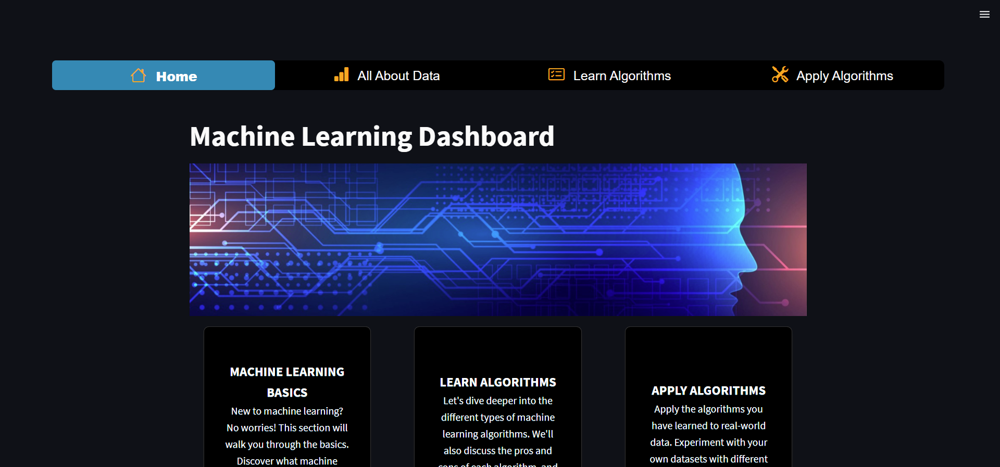
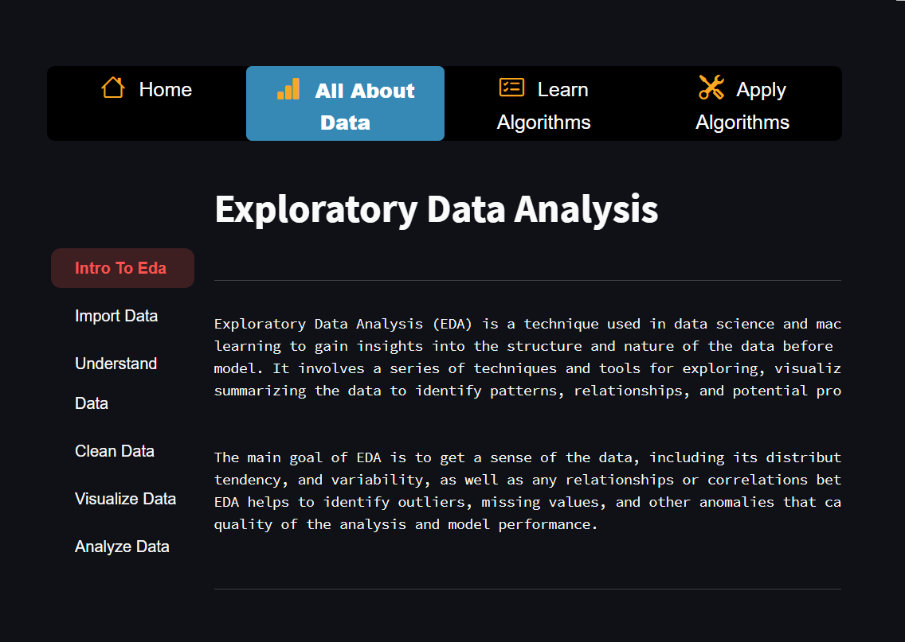
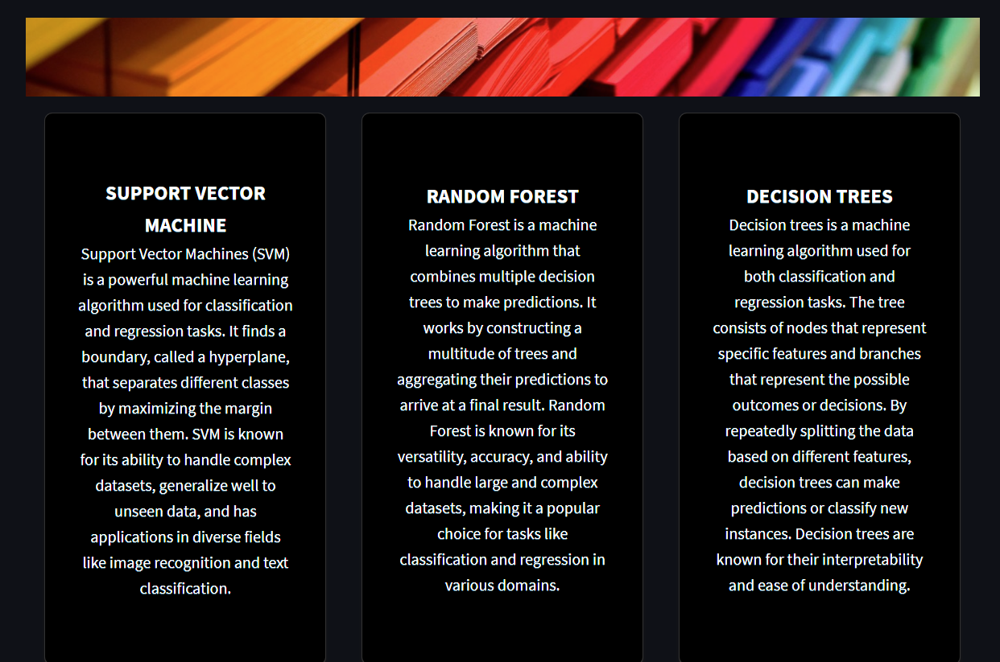
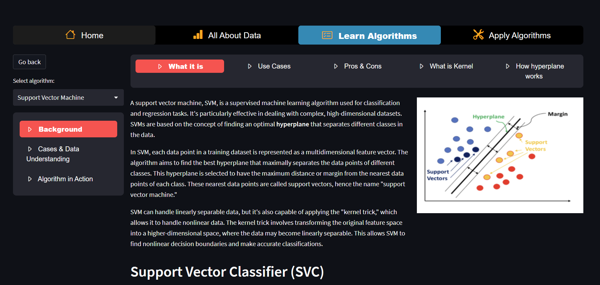
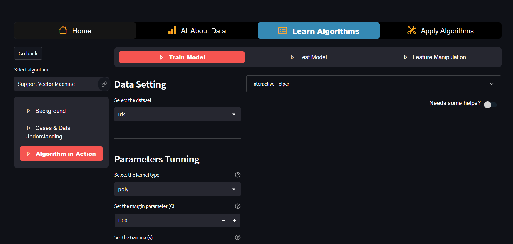
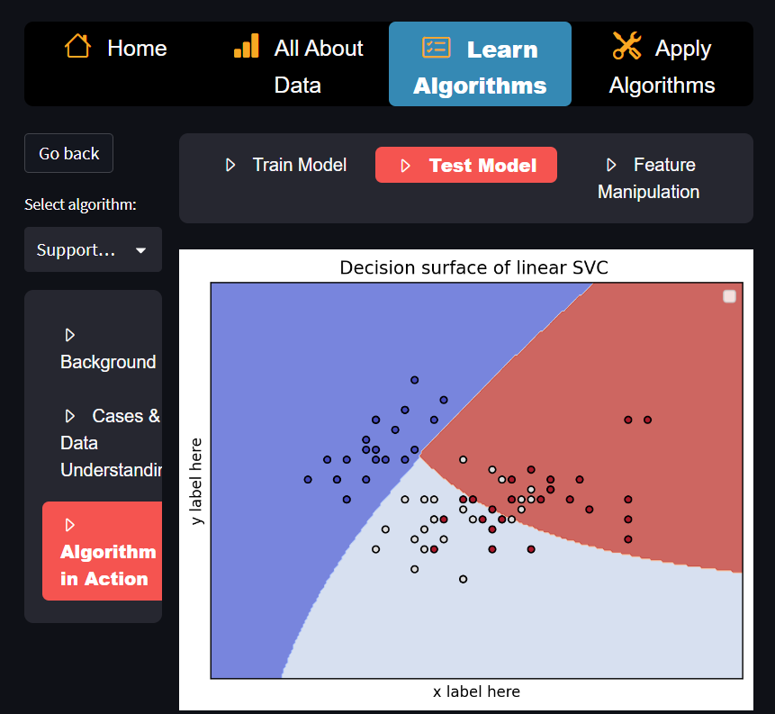
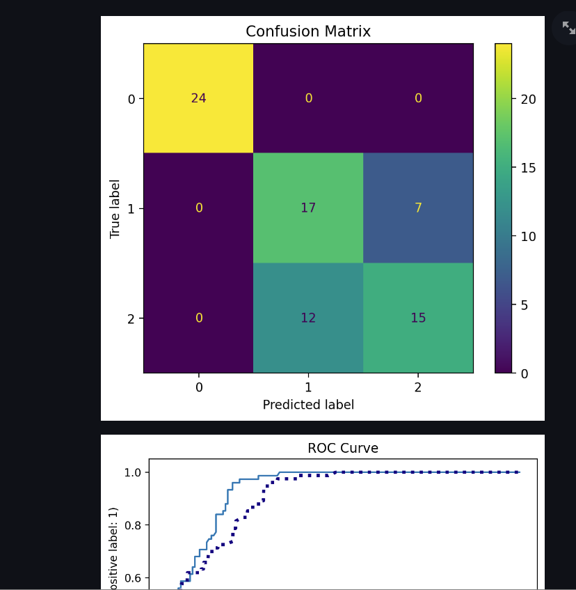

# EducativeMLDashbaord

Developer: Jiacheng (Jackie) Chen, Runjie (RJ) Lyu, Macarious Kin Fung Hui, Victor Wu, Xiaolai (Sean) Chen

Instructor: Dr. Mona Ali, Associate Teaching Professor, Northeastern University Vancouver Campus

This web application is under active developement. Machine Learning background, SVM learning demo is live.

To run the code on your own machine, run the following commands
```
python3 -m pip install -r requirements.txt
python3 -m streamlit run main.py
```

Otherwise, please use the url link to access the web application.

https://jackie-educative-machine-learning-dashboard.streamlit.app/

## Modules

### Current Imported Modules
1. streamlit 

    https://streamlit.io/
2. streamlit_option_menu 
    
    github: https://github.com/victoryhb/streamlit-option-menu
3. streamlit-extras
    
    github: https://github.com/arnaudmiribel/streamlit-extras
    
    demo: https://extras.streamlit.app/
4. streamlit_antd_components 
    
    github: https://github.com/nicedouble/StreamlitAntdComponents
    
    demo: https://nicedouble-streamlitantdcomponentsdemo-app-middmy.streamlit.app/
5. numpy
   
   https://numpy.org/
6. pandas
   
   https://pandas.pydata.org/
7. matplotlib
   
   https://matplotlib.org/
8. sklearn
   
   https://scikit-learn.org/stable/

## App Gallery
### Home page



### Exploratory Data Analysis



### Main page of Learning Algorithms



### SVM Background



### Learn SVM in preset datasets



### Graphing



### More graphing

